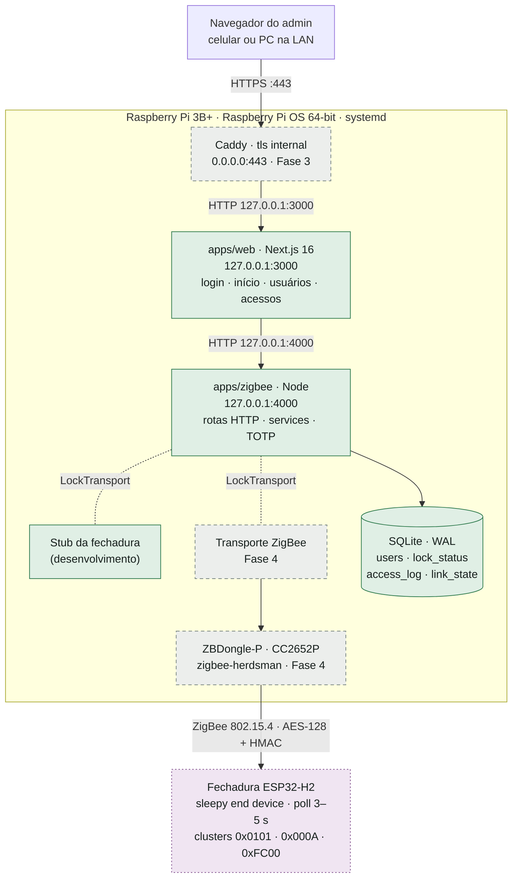

# Plano de desenvolvimento do SmartEntry (Raspberry Pi)

PCS3848 · Sistemas Embarcados · Poli-USP

Este plano cobre o lado Raspberry Pi da fechadura SmartEntry: a interface web, a ponte ZigBee e a réplica local de usuários (`raspberry_pi/smart-entry`). A fechadura (ESP32-H2, pasta `fechadura/`) é desenvolvida por outro time e aparece aqui como a interface que precisamos combinar.

Atualizado em 9 de outubro de 2026. A instalação e as evidências de validação estão em [`deploy-raspberry-pi.md`](deploy-raspberry-pi.md).

## Situação

| Fase | Tema | Situação |
|---|---|---|
| 0 | Ajustes na base | Concluída |
| 1 | Testes automatizados | Concluída |
| 2 | Interface web (`apps/web`) | Implementada, falta validar no navegador |
| 3 | Deploy no Raspberry Pi | Instalado e validado com simulador; atualização e queda de energia pendentes |
| 4 | ZigBee real | Aguarda o firmware |
| 5 | Revisão de segurança | HTTPS, cookies e loopback verificados; ZigBee pendente |
| 6 | Integração e validação | Planejada |
| 7 | RFID | Opcional |

50 testes automatizados passando (14 em `apps/web`, 13 em `packages/db`, 23 em `apps/zigbee`). As 10 decisões estão documentadas; as propostas marcadas como firmware ainda precisam de confirmação do outro time.

### Próximos passos imediatos

1. Validar a interface no navegador e no celular (Fase 2), incluindo avisos de erro, QR e largura pequena.
2. Validar atualização e recuperação após queda de energia conforme [`deploy-raspberry-pi.md`](deploy-raspberry-pi.md). Instalação com simulador, HTTPS, portas e reboot já verificados no Pi (Fase 3).
3. Confirmar o protocolo com o time do firmware e obter o dongle/firmware mínimo para o spike (Fase 4). O firmware deste checkout ainda usa senha fixa `1234` no fluxo principal.

Já implementados: bloqueio de operações concorrentes, recuperação por sync após timeout de cadastro/remoção, tratamento de respostas inválidas da API, execução de produção com `tsx`, unidades systemd, Caddyfile e modelos de ambiente em `deploy/`. O deploy com simulador foi validado no Pi 3B+ (Debian 13 arm64) em 9 de outubro de 2026, incluindo login HTTPS e reboot. Build no Pi usa `build:pi` com Webpack e `SMART_ENTRY_LOW_MEMORY_BUILD=1`; Turbopack excedeu a memória disponível. Integração real, atualização e resistência a quedas de energia continuam pendentes.

## Arquitetura

Dois processos isolados no systemd. Só o Caddy fica exposto na rede; o Next e o `apps/zigbee` escutam apenas em `127.0.0.1`. O pacote `packages/shared` (contratos Zod) é usado pela web, pelo `apps/zigbee` e pelo banco.



Legenda: verde = implementado · cinza tracejado = planejado · roxo pontilhado = outro time (firmware).

### Fluxos principais

- **Destravar:** a web chama `POST /unlock`, o `apps/zigbee` envia `unlockDoor` com HMAC e espera a confirmação. Sem resposta em 15 s, devolve 504. Sucesso ou falha vão para o log como `remote`.
- **Cadastrar:** o Pi gera o segredo TOTP, envia com `setUser` e só grava o usuário depois da confirmação, sem o segredo. A web mostra o QR code uma única vez.
- **Sincronizar:** no boot e pelo botão. `listSlots` devolve 10 bytes, o Pi faz merge por slot (mantém os nomes) e grava `synced_at`.
- **Status:** a fechadura reporta `lockState` quando muda. A web consulta `/status` a cada 3 s.
- **Hora:** a fechadura lê a hora do Pi no boot e uma vez por dia. O Pi só responde se o relógio foi sincronizado por NTP.

## Fases

### Fase 0 · Ajustes na base · Concluída

Pronto quando todas as rotas funcionam contra o stub, inclusive os casos de erro.

- [x] Interface `LockTransport` no formato do protocolo
- [x] Erros tipados e stub configurável (atraso ou fechadura inacessível)
- [x] Sync com merge por slot, mantendo os nomes e gravando `synced_at`
- [x] Sync automático na inicialização, sem travar o servidor
- [x] Segredo TOTP de 20 bytes e URI `otpauth://`
- [x] Tabelas `access_log` e `link_state`; slot limitado a 0–9 no banco
- [x] Rotas `PATCH`, `DELETE /users/:id`, `/health`, `/access-log` e erros 409, 503, 504

### Fase 1 · Testes automatizados · Concluída

Pronto quando `pnpm run test` passa.

- [x] Runner `node:test` via `tsx --test`, sem dependência nova
- [x] `packages/db`: merge, transação, limite do log, contador, migrações
- [x] `apps/zigbee`: todas as rotas, erros 400 a 504, TOTP
- [x] Task `test` no Turborepo
- [x] Regressões: operações concorrentes, cadastro/remoção confirmados após timeout e resposta inválida da API

### Fase 2 · Interface web · Falta validar no navegador

Pronto quando o fluxo completo funciona no navegador contra o stub.

- [x] Login: `pnpm hash-password`, página `/login`, sessão de 12 h, bloqueio após 5 erros por minuto
- [x] Sessão verificada em toda página, ação e rota de API
- [x] Cliente tipado para `127.0.0.1:4000`, incluindo o caso do serviço fora do ar
- [x] Início: estado da porta a cada 3 s e botão destravar com espera
- [x] Usuários: lista, cadastro com QR mostrado uma vez, renomear, remover, sync
- [x] Acessos com falhas em destaque e o nome gravado no momento do evento
- [x] Avisos para fechadura desconectada e serviço fora do ar
- [x] Migrações do banco por `PRAGMA user_version`
- [ ] Validar no navegador: cadastro com QR no celular, destravar, renomear, remover, largura de celular
- [ ] Validar avisos com serviço parado, fechadura inacessível e confirmação atrasada; recuperar cadastro sem QR removendo e cadastrando novamente

Login, logout, proteção das páginas e avisos de erro já foram testados por HTTP.

### Fase 3 · Deploy no Raspberry Pi · Instalado com simulador

Pronto quando o painel abre via HTTPS no Pi e volta sozinho depois de um reinício.

- [x] Node 22.23.3 arm64, npm 10.9.9, pnpm 12.4.2, `build-essential` e `python3`
- [x] Execução de produção do `apps/zigbee`: `tsx src/index.ts`; `build` valida tipos com `tsc --noEmit`
- [x] Modelos systemd, Caddy e ambientes em `deploy/`; web de produção vinculada a `127.0.0.1`
- [x] Roteiro de instalação, atualização, backup e recuperação em [`deploy-raspberry-pi.md`](deploy-raspberry-pi.md)
- [x] `/var/lib/smart-entry` para dados e `/etc/smart-entry` para segredos (permissão 600)
- [x] Serviços `smart-locker-web` e `smart-locker-zigbee` com `Restart=always`
- [x] Caddy com `tls internal` na frente do Next; login validado por HTTPS
- [x] Usuário do serviço no grupo `dialout`
- [x] Build, 50 testes, typecheck e lint no Pi; build com Webpack e um worker
- [x] Reboot real: web, ponte e Caddy retornaram automaticamente
- [ ] Executar atualização e teste de tirar o Pi da tomada; registrar evidências

### Fase 4 · ZigBee real · Aguarda o firmware

Pronto quando todas as rotas funcionam com a fechadura real. Depende do dongle em mãos e do protocolo combinado.

- [ ] Spike: `zigbee-herdsman` + ZBDongle-P pareando um ESP32-H2 de teste
- [ ] Chave de rede aleatória; pareamento só por script
- [ ] `ZigbeeLockTransport` com a mesma interface do stub
- [ ] HMAC com o contador persistido em `link_state`
- [ ] Time-guard: hora só com NTP sincronizado; checar se o herdsman responde pedidos de hora sozinho
- [ ] Timeouts ajustados ao poll; implementar a opção real de `SMART_ENTRY_TRANSPORT` (hoje só `fake` é aceito; outros valores encerram o processo)
- [ ] Garantir que comandos não executem após o encerramento definitivo da promessa; limitar comandos pendentes e validar recuperação após reiniciar a ponte

### Fase 5 · Revisão de segurança · Parcial

Depende das Fases 3 e 4.

- [x] HTTPS ativo; cookies `HttpOnly`, `Secure` e `SameSite=Strict`, conferidos após login
- [ ] Pareamento fechado; chaves com permissão 600
- [ ] Teste de replay: comando reenviado é rejeitado
- [x] Apps só em `127.0.0.1`, conferido com `ss -tlnp`

### Fase 6 · Integração e validação · Planejada

Depende das Fases 4 e 5.

- [ ] Cadastro → QR no celular → `<slot><código>#` na fechadura → porta abre → log
- [ ] Latência do destravamento remoto medida
- [ ] Fechadura desligada: erro claro e dados consistentes
- [ ] 11º usuário rejeitado
- [ ] Pi sem internet não passa hora errada à fechadura
- [ ] Queda de energia durante um sync; evidências de RNF2 a RNF5

### Fase 7 · RFID · Opcional

Fica para o fim, se houver tempo.

- [ ] Modo de cadastro do cartão na fechadura
- [ ] Botão de cadastro na tela de usuários
- [ ] Método `rfid` no log de acessos

## Decisões

As marcadas com "(firmware)" são propostas que o time do firmware precisa confirmar.

| # | Tema | Decisão |
|---|---|---|
| B1 | Protocolo ZigBee (firmware) | Híbrido: Door Lock `0x0101` e Time `0x000A` padrão, cluster próprio `0xFC00` para os slots. A fechadura não guarda nomes. |
| B2 | Dongle | Sonoff ZBDongle-P (CC2652P, driver `zstack`), acessado por `/dev/serial/by-id`. |
| B3 | Energia da fechadura (firmware) | Sleepy end device com poll de 3–5 s (abaixo do limite de 7,68 s) e poll rápido após atividade. Timeout de 15 s na web. |
| B4 | Login do admin | Um admin, só senha, hash `scrypt` em `ADMIN_PASSWORD_HASH`, sessão com `iron-session` de 12 h, limite global de tentativas. |
| B5 | Criptografia (RNF3) | Chave de rede aleatória, pareamento só no cadastro, HMAC + contador nos comandos, HTTPS via Caddy. |
| B6 | Cadastro (firmware) | O Pi gera o segredo TOTP, envia à fechadura e mostra o QR uma vez. O segredo não fica guardado no Pi. |
| B7 | Log de acessos | Sim: últimos 500 eventos, com o nome do slot gravado no momento do evento. |
| B8 | Autenticação (firmware) | Só TOTP por enquanto, digitado como `<slot><código>#`. RFID fica opcional para o fim. |
| B9 | Status na web | Atualização a cada 3 s e logo depois de destravar. |
| B10 | Hora do TOTP (firmware) | Sem módulo RTC. O Pi só informa a hora se sincronizada por NTP; a fechadura recusa saltos grandes. |

## API interna do `apps/zigbee`

Escuta em `127.0.0.1:4000` e só a web chama. Toda escrita vai primeiro à fechadura; a réplica só muda depois da confirmação. Os formatos dos dados estão em `packages/shared/src/index.ts`.

| Rota | O que faz | Erros |
|---|---|---|
| `GET /health` | Processo vivo e conexão com a fechadura | — |
| `GET /status` | Estado da porta | — |
| `POST /unlock` | Destrava, espera a confirmação e registra no log | 409, 503, 504 |
| `GET /users` | Lista da réplica | — |
| `POST /users` | Cadastra `{id, name}` e devolve o `totpUri` uma vez | 400, 409, 503, 504 |
| `PATCH /users/:id` | Renomeia, só no Pi | 400, 404, 409 |
| `DELETE /users/:id` | Remove da fechadura e depois da réplica | 400, 404, 409, 503, 504 |
| `POST /sync` | Sincronização completa com merge por slot | 409, 503, 504 |
| `GET /access-log?limit=` | Últimos acessos, do mais novo ao mais antigo | 400 |

Códigos: 400 entrada inválida · 404 usuário ou rota inexistente · 409 conflito (slot ocupado, operação pendente ou sync necessário) · 503 fechadura inacessível · 504 fechadura não respondeu a tempo.

Operações na fechadura são exclusivas: enquanto uma confirmação estiver pendente, outro comando, sync ou renomeação recebe 409 com `code: lock-busy`. As leituras continuam disponíveis. Um timeout de cadastro/remoção exige sync antes de novas alterações (`code: sync-required`); o bloqueio permanece até a operação original terminar. Sync recupera um cadastro tardio sem QR: remova esse slot e cadastre novamente. Destravamento continua permitido após o comando pendente terminar, mesmo com sync de usuários necessário. A proteção atual é por processo; recuperação após reinício e garantias de entrega precisarão de validação no transporte real.

## Modelo de dados

SQLite em modo WAL. A réplica pode ser reconstruída por um sync; o contador do HMAC não pode. Por isso o esquema evolui por migrações numeradas (`PRAGMA user_version`, em `packages/db/src/schema.ts`), sem nunca recriar o banco.

| Tabela | Colunas | Observação |
|---|---|---|
| `users` | `id, name, has_totp, has_rfid, created_at, synced_at` | Slot 0–9 como chave. Sem segredo TOTP. O nome é dado do Pi. |
| `lock_status` | `locked, updated_at` | Linha única. Começa travada (RNF4). |
| `access_log` | `id, slot, user_name, method, result, received_at` | Últimos 500 eventos. `user_name` é o nome do slot no momento do evento. `method`: `totp`, `rfid` ou `remote`. |
| `link_state` | `hmac_counter` | Linha única. O contador nunca se repete, nem depois de reiniciar. |

## Protocolo ZigBee proposto

Proposta para validar com o time do firmware. O HMAC é SHA-256 truncado em 16 bytes, calculado sobre comando, slot, dados e contador.

| Cluster | Direção | Conteúdo |
|---|---|---|
| `0x0101` Door Lock | Pi → fechadura | `unlockDoor`, com contador e HMAC no campo de código |
| `0x0101` Door Lock | fechadura → Pi | Atributo `lockState`, reportado a cada mudança |
| `0x000A` Time | fechadura lê do Pi | Segundos desde 01/01/2000 UTC, no boot e uma vez por dia |
| `0xFC00` próprio | Pi → fechadura | `listSlots`: resposta de 10 bytes (bit 0 ocupado, bit 1 TOTP, bit 2 RFID) |
| `0xFC00` próprio | Pi → fechadura | `setUser(slot, segredo de 20 B, contador, HMAC)`, cerca de 41 bytes |
| `0xFC00` próprio | Pi → fechadura | `clearUser(slot, contador, HMAC)` |
| `0xFC00` próprio | fechadura → Pi | `accessEvent(slot, método, resultado)`, só para teclado e RFID |

### Para combinar com o time do firmware

- Formato do cluster `0xFC00` e código de fabricante
- Intervalos de poll normal e rápido
- Digitação `<slot><código>#` e janela de ±30 s
- Recusar saltos de hora; cristal externo de 32 kHz; pedir a hora no boot e uma vez por dia
- Chave do HMAC definida no pareamento e contador persistido nos dois lados
- A fechadura não reporta destravamentos remotos (o Pi já registra)
- Um firmware mínimo para o spike da Fase 4

## Riscos

| Risco | Impacto | Mitigação |
|---|---|---|
| Integração ZigBee atrasar ou não funcionar | Alto | Spike cedo; o stub mantém a web e os testes andando |
| Destravamento lento por causa do sono da fechadura | Médio | Poll de até 5 s, timeout de 15 s e mensagem de espera na tela |
| Herdsman responder pedidos de hora sozinho | Médio | Verificar no spike; plano B é enviar a hora pelo `0xFC00` |
| Banco do Pi perdido zera o contador do HMAC | Médio | Combinar com o firmware um re-pareamento ou ressincronização do contador |
| Execução de produção ainda não validada em arm64 | Médio | `tsx` definido como runtime; instalar dependências e validar serviços no Pi na Fase 3 |
| `better-sqlite3` não compilar no Pi | Baixo | `build-essential` e `python3`; testar logo na Fase 3 |
| Cartão SD corromper em queda de energia | Médio | Backup consistente; sync recupera slots, mas não nomes, histórico ou contador HMAC. Perda/regressão do contador exige recuperação acordada com o firmware |
| `iron-session` 9 exige Node 22.13+ | Baixo | Instalar Node 22 LTS no Pi na Fase 3 |

## Como rodar em desenvolvimento

Requisitos: Node 22.13 ou mais novo e pnpm 12 (`npm install -g pnpm@12.4.2`). Os comandos abaixo rodam dentro de `raspberry_pi/smart-entry`.

1. Instale as dependências:
   ```bash
   pnpm install
   ```
2. Gere a senha do painel. Dentro de `apps/web`, rode o comando abaixo e cole as duas linhas que ele imprime num arquivo novo `apps/web/.env.local` (o arquivo não vai para o git):
   ```bash
   pnpm hash-password
   ```
3. Suba a web e o `apps/zigbee` (com a fechadura simulada) e abra http://localhost:3000:
   ```bash
   pnpm exec turbo run dev --filter=web --filter=zigbee
   ```
4. Rode as verificações:
   ```bash
   pnpm run test
   pnpm run typecheck
   pnpm run lint
   ```

Para simular falhas da fechadura, suba o `apps/zigbee` com `SMART_ENTRY_FAKE_UNREACHABLE=1` (erro 503) ou `SMART_ENTRY_FAKE_DELAY_MS=20000` (erro 504).

No Windows, use `pnpm exec turbo run <script> --filter=<pacote>` em vez de `pnpm --filter <pacote> <script>`: este último falha por causa do caminho longo da pasta do projeto.
